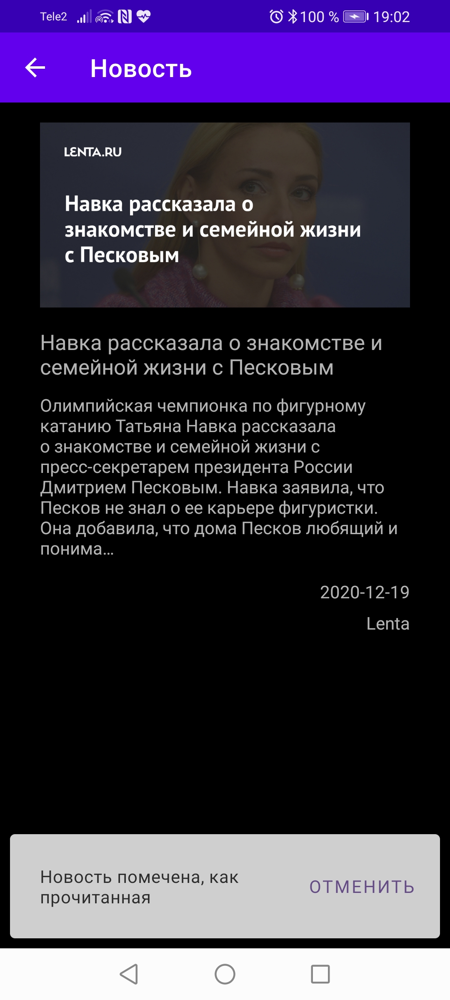

# Newegator

Простейшее приложение, которые можно использовать для просмотра новостей из
различных источников

Использует REST API от сайта newsapi.org 

В приложение используется MVP архитектура на базе библиотеки Moxy,
а также библиотека dagger2 для внедрения зависимостей

## Скриншоты

|   |   |   |
|---|---|---|
| |  | |
| |  | |
| |  | |
| |   |   |
